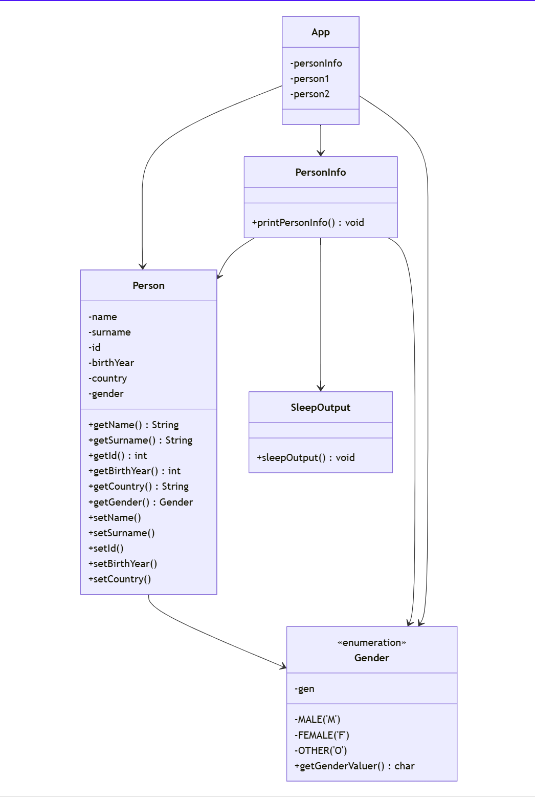
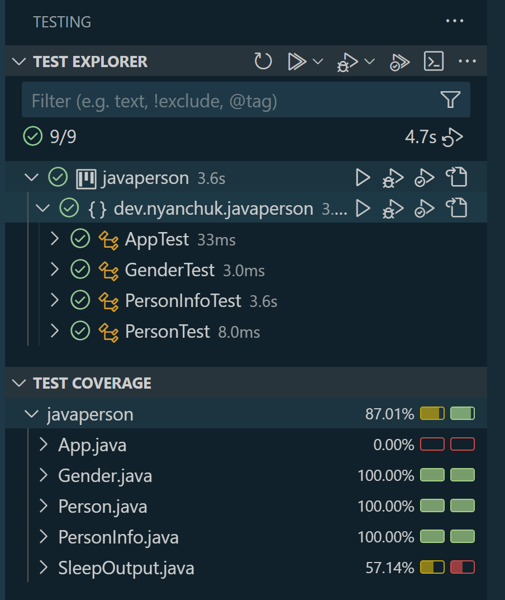

# Java Person Model

## Project Description

The **Java Person Model** is a console-based Java application designed to model the concept of a "Person" with various attributes, including name, surname, ID number, year of birth, country of birth, and gender. This project demonstrates object-oriented programming concepts, including the use of constructors, methods, and enums for attribute management.

## Project Requirements

The **Person** class in this project includes:

1. **Attributes**:
   - `name` (String): Person’s first name.
   - `surname` (String): Person’s surname.
   - `id` (int): Unique ID number for each person.
   - `birthYear` (int): Year of birth.
   - `country` (String): Country of birth.
   - `gender` (char): Person's gender, represented by 'M' (Male), 'F' (Female), or 'O' (Other).

2. **Constructor**:
   - Initializes each of the **Person** attributes.

3. **Methods**:
   - **printPersonInfo**: This method prints each of the **Person** object’s attributes to the console.

## Application Entry Point

The **App** class serves as the console application entry point:
   - In `main`, two `Person` objects are created with sample data.
   - Each object's attributes are displayed in the console through the `printPersonInfo` method.

## Setup and Usage

### Prerequisites

Ensure you have the following installed:

- **Java Development Kit (JDK) 8** or higher.

### Installation and Running the Application

1. **Clone the Repository**:

       git clone https://github.com/NelliYanchuk/java-person-model.git

2. **Navigate to the Project Directory**:

       cd java-person-model

3. **Compile the Program**:

       javac -d bin src/dev/nyanchuk/javaperson/*.java

4. **Run the App Class**:

       java -cp bin dev.nyanchuk.javaperson.App

### Expected Output

The application will display the attributes of each `Person` object in the console.

## Project Diagram

Also you can find diagram here `images/diagram-person.png`

## Testing

### Requirements:
- A minimum of 70% code coverage is required.

### Code Coverage

In Visual Studio Code, navigate to the **Testing** section to run tests and observe code coverage. The project ensures a minimum of 70% coverage across all methods.

Also you can find test covering here `images/test-cover-person.png`

## Deliverables

1. **GitHub Repository**: [Project Repository](https://github.com/NelliYanchuk/java-person-model)
2. **Object Diagram**: Diagram of the `Person` structure.
3. **Testing Screenshot**: A screenshot of the code coverage from the Visual Studio Code **Testing** section.

## Connect with me:

- [GitHub](https://github.com/NelliYanchuk)
- [LinkedIn](https://www.linkedin.com/in/nelli-yanchuk-a24b81138/)

